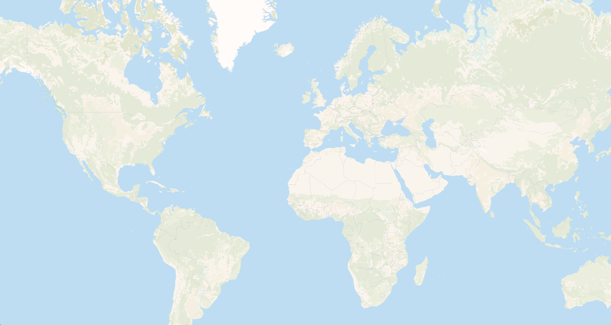

# Versatiles Landcover Vectors

A set of vector tiles based on [ESA Worldcover](https://esa-worldcover.org/en/data-access).

There are to complement OSM tiles on lower zoom levels.

## Example



## Requirements

* `node` (or `bun`)
* [`versatiles`](https://github.com/versatiles-org/versatiles-rs/blob/main/versatiles/README.md#install)
*

## How it's made

### Download raster tiles

``` sh
node bin/download-esa-worldcover.js
```

This downloads the [ESA Worldcover](https://esa-worldcover.org/en/data-access) tiles at zoom level 10 (~5.2GB) from the Terrascope WMTS service.

### Extract channels

``` sh
node bin/extract-channels.js
```

This extracts the distinctly colored channels from the tiles into monochrome tiles per channel.

### Composite lower zoom raster tiles

``` sh
node bin/composite-tiles.js
```

This creates tiles for zoom levels below 10 by compositing the tiles of higher zoom levels.

### Create vector tiles from composited rasters

```sh
node bin/render.js
```

This vectorizes channel raster tiles and combines them into vectortiles.
By default zoom levels 0-8 are created, you can pass the desired target zoom level as parameter:

```sh
node bin/render.js 6
```

⚠️ Note that `potrace-wasm` appears to leak memory and the script will run out of memory eventually.
You can run the script again, already created tiles will be skipped.

### Simplify vector tile polygons

``` sh
node bin/simplify.js
```

This simplifies the polygons in each tile larger than 100kb using the Visvalingam–Whyatt algorithm.
The algorithm has been slightly modified to keep tile edges intact.

### Convert to Versatiles container

``` sh
versatiles convert -c brotli tiles/vectortiles-simplified landcover-vectors.versatiles
```
This compresses and packs all vectortiles into a versatiles container.

## Style

There is one layer called `landcover-vectors` with a property `kind`:

* `bare` Bare / sparse vegetation
* `builtup` Built-up
* `cropland` Cropland
* `grassland` Grassland
* `mangroves` Mangroves
* `moss` Moss and lichen
* `shrubland` Shrubland
* `snow` Snow and ice
* `treecover` Tree cover
* `water` Permanent water bodies
* `wetland` Herbaeceous wetland

### Example

``` js
{
	"id": "landcover-bare",
	"type": "fill",
	"source-layer": "landcover-vectors",
	"source": "versatiles-landcover",
	"filter": [ "all", ["==", "kind", "bare"] ],
	"paint": {
		"fill-color": "#FAFAED",
		"fill-opacity": { "stops": [[0, 0.2], [10, 0.2], [11, 0]] },
		"fill-antialias": true,
		"fill-outline-color": "#ffffff00"
	}
}
```

## License

* [ESA Worldcover](https://esa-worldcover.org/en/data-access) is licensed [CC BY 4.0](http://creativecommons.org/licenses/by/4.0/)
* The Versatiles Landcover Vectors tileset is derived from ESA Worldcover and therefore also licensed [CC BY 4.0](http://creativecommons.org/licenses/by/4.0/)
* The code in this repository is in the [Public Domain](http://unlicense.org/UNLICENSE)
