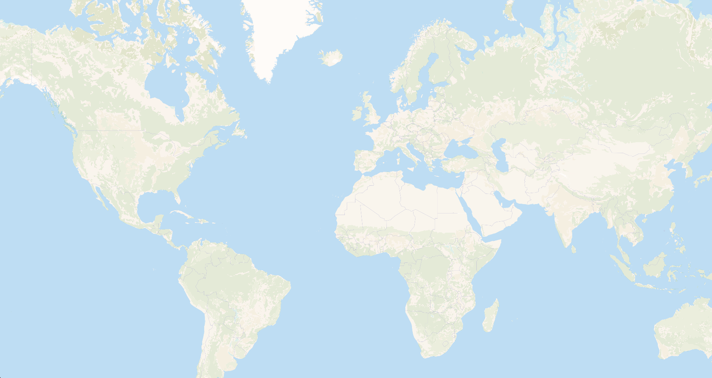

# Versatiles Landcover Vectors

A set of vector tiles based on [ESA Worldcover](https://esa-worldcover.org/en/data-access).

There are to complement OSM tiles on lower zoom levels.

## Example



## Requirements

- `node` (or `bun`)
- [`GDAL`](https://gdal.org/) ≥ 3.2 (`gdalbuildvrt` and `gdal2tiles.py` on `PATH`)
- [`versatiles`](https://github.com/versatiles-org/versatiles-rs/blob/main/versatiles/README.md#install)

## How it's made

Each step below can be run directly with `node`, or via its npm script (shown after the `# or` line).
To run the whole pipeline (import → extract → render → simplify → pack) in order:

```sh
npm run build
```

### Import raster tiles

```sh
node bin/import-worldcover.js
# or
npm run import
```

This imports [ESA WorldCover 2021 (v200)](https://registry.opendata.aws/esa-worldcover-vito/) from AWS Open Data
(`s3://esa-worldcover`) and cuts a web-mercator XYZ raster pyramid (zoom levels 0–6 by default) into
`tiles/esa-worldcover` using GDAL.

Tiles are **4096×4096 px** — matching the MVT extent the renderer uses. A 4096 px tile at a given zoom has the same
ground resolution as a 256 px tile four zoom levels deeper, so the zoom-6 tiles carry zoom-10 detail in a single,
seam-free tile that the renderer vectorizes at native resolution (no upscaling). This produces far fewer, larger
tiles than a deep 256 px pyramid would.

The 2651 source GeoTIFFs are first downloaded in parallel to a local mirror in `tiles/esa-worldcover-src`
(~**124 GB**, so make sure you have the disk space), then tiled from local disk — much faster than streaming each
block over the network during tiling. The download is resumable: already-downloaded tiles are verified by size and
skipped. `gdal2tiles` uses `mode` resampling, which keeps land-cover classes pure when downsampling — so the lower
zoom levels are categorically correct and no separate compositing step is needed.

You can pass a zoom range as parameter (default `0-6`):

```sh
node bin/import-worldcover.js 0-4
# or
npm run import -- 0-4
```

> The old `download` step used the Terrascope WMTS service, which is no longer available — hence the move to the
> AWS Open Data mirror.

### Extract channels

```sh
node bin/extract-channels.js
# or
npm run extract
```

This splits each imported tile into monochrome masks per land-cover class (one mask per `kind`), for every zoom
level. Tiles are classified directly from the ESA WorldCover palette. By default zoom levels 0–6 are processed;
pass a maximum zoom as parameter (e.g. `npm run extract -- 4`).

### Create vector tiles from the channel masks

```sh
node bin/render.js
# or
npm run render
```

This vectorizes channel raster tiles and combines them into vectortiles.
By default zoom levels 0-6 are created, you can pass the desired target zoom level as parameter:

```sh
node bin/render.js 4
# or
npm run render -- 4
```

⚠️ Note that `potrace-wasm` appears to leak memory and the script will run out of memory eventually.
You can run the script again, already created tiles will be skipped.

### Simplify vector tile polygons

```sh
node bin/simplify.js
# or
npm run simplify
```

This simplifies the polygons in each tile larger than 100kb using the Visvalingam–Whyatt algorithm.
The algorithm has been slightly modified to keep tile edges intact.

### Convert to Versatiles container

```sh
versatiles convert -c brotli tiles/vectortiles-simplified landcover-vectors.versatiles
# or
npm run pack
```

This compresses and packs all vectortiles into a versatiles container.

## Style

There is one layer called `landcover-vectors` with a property `kind`:

- `bare` Bare / sparse vegetation
- `builtup` Built-up
- `cropland` Cropland
- `grassland` Grassland
- `mangroves` Mangroves
- `moss` Moss and lichen
- `shrubland` Shrubland
- `snow` Snow and ice
- `treecover` Tree cover
- `water` Permanent water bodies
- `wetland` Herbaeceous wetland

### Example

```js
{
	"id": "landcover-bare",
	"type": "fill",
	"source-layer": "landcover-vectors",
	"source": "versatiles-landcover",
	"filter": [ "all", ["==", "kind", "bare"] ],
	"paint": {
		"fill-color": "#FAFAED",
		"fill-opacity": { "stops": [[0, 0.2], [10, 0.2], [11, 0]] },
		"fill-antialias": true,
		"fill-outline-color": "#ffffff00"
	}
}
```

## License

- [ESA Worldcover](https://esa-worldcover.org/en/data-access) is licensed [CC BY 4.0](http://creativecommons.org/licenses/by/4.0/)
- The Versatiles Landcover Vectors tileset is derived from ESA Worldcover and therefore also licensed [CC BY 4.0](http://creativecommons.org/licenses/by/4.0/)
- The code in this repository is in the [Public Domain](http://unlicense.org/UNLICENSE)
